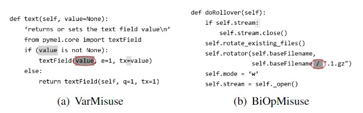

# CodeBERT-Ptr

CodeBERT-Ptr (short for pointer) is a repo for finetuning CodeBERT for **fine-grained (token-level)** bug localization.

The model is similar to ["Neural Program Repair by Jointly Learning to Localize and Repair"](https://arxiv.org/pdf/1904.01720.pdf) except that we finetune CodeBERT instead of training an LSTM model. Futhermore, we only use the model to localize bug and remove the part of repair.

Attention again! We focus on **token-level** bugs here, e.g., variable misuse, operator misuse. Here is an example:



The model use an "pointer" to predict the buggy position.


## Dataset

You can download an example dataset of operator misuse ("<" or "<=") from [this link](https://drive.google.com/drive/folders/1fc_IQ4O2sP5HMegiYboKq27XbqwfjJ4J?usp=sharing) or create your own dataset.

The dataset is split into three parts: "train.pkl", "valid.pkl", and "test.pkl". Each file is a python dict stored with python package "pickle". The python dict consists three keys: "norm", "label", "idx". Norm is a normalized code token sequence. Label is the label of whether this is a bug. Idx is the index of the buggy token.

E.g.:

```python
{
    'norm': ['public', 'static', 'void', 'skipFully', '(', ..., '}'],
    'label': 1,
    'idx': 0    # should be private static void
}
```

### Environment

The following packages are required to run the code.

```bash
# packages
torch
transformers
sklearn
```

### Training and Evaluation

```bash
# train - adjust arguments in `train_classifier.sh` and run
bash train_classifier.sh

# eval - change model path and dataset path in eval.py and run
python eval.py
```